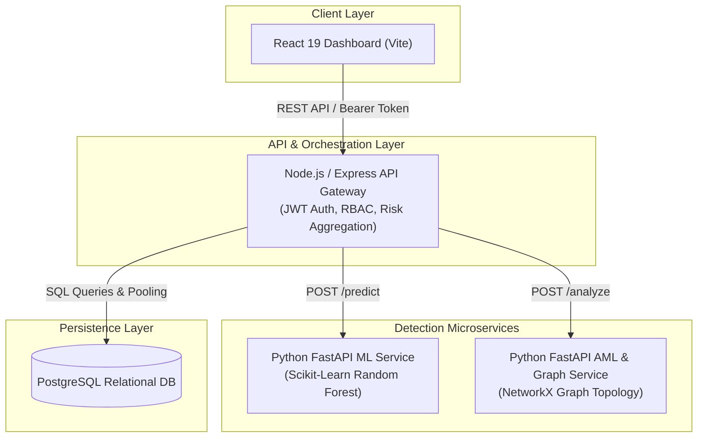
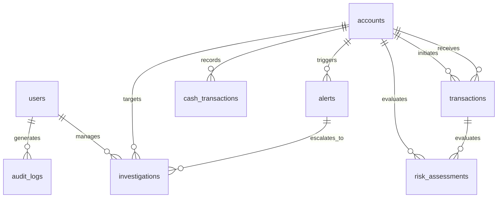

# 🛡️ MuleGuard — Anti-Money Laundering & Money Mule Detection Platform

[](https://opensource.org/licenses/MIT)
[](https://nodejs.org/)
[](https://expressjs.com/)
[](https://www.python.org/)
[](https://fastapi.tiangolo.com/)
[](https://scikit-learn.org/)
[](https://networkx.org/)
[](https://react.dev/)
[](https://vitejs.dev/)
[](https://www.postgresql.org/)
[](https://www.docker.com/)

**MuleGuard** is an end-to-end, microservice-oriented Anti-Money Laundering (AML) intelligence and money mule detection platform. It empowers financial institutions, AML analysts, and compliance teams to proactively detect illicit fund movements, identify coordinated money mule networks, triage high-risk alerts, and conduct comprehensive forensic investigations.

---

## 📌 Table of Contents

- [The Problem \& Objective](#-the-problem--objective)
- [System Architecture](#-system-architecture)
- [Core Detection Engines](#-core-detection-engines)
- [Key Features](#-key-features)
- [Tech Stack](#-tech-stack)
- [Repository Structure](#-repository-structure)
- [Database Schema](#-database-schema)
- [Getting Started](#-getting-started)
  - [Prerequisites](#prerequisites)
  - [1. Database Setup](#1-database-setup)
  - [2. AML Service Setup](#2-aml-service-setup)
  - [3. ML Service Setup](#3-ml-service-setup)
  - [4. Backend Gateway Setup](#4-backend-gateway-setup)
  - [5. Frontend Client Setup](#5-frontend-client-setup)
- [API Documentation](#-api-documentation)
- [Docker Deployment](#-docker-deployment)
- [Contributing](#-contributing)
- [License](#-license)

---

## 🚨 The Problem & Objective

### The Challenge
Criminal networks rely on layers of mule accounts to fragment (fan-out), transfer, and aggregate (fan-in) illicit funds across banking ecosystems. Because individual transactions often stay under traditional static thresholds, isolated rule-based monitoring systems frequently fail to identify organized money laundering rings.

### The MuleGuard Solution
MuleGuard combines **heuristic AML rules**, **machine learning anomaly scoring**, and **graph-theoretic network analysis** into a unified multi-engine risk pipeline.

```
┌─────────────────┐       ┌────────────────────────┐       ┌────────────────────────┐
│  Transaction    │ ───►  │  Multi-Engine Pipeline │ ───►  │  Decision & Action     │
│  Ingestion      │       │  • ML Anomaly (60%)    │       │  • ALLOW / REVIEW /    │
│                 │       │  • Rule Engine (20%)   │       │    BLOCK               │
│                 │       │  • Graph Network (20%) │       │  • Explainable Signals │
└─────────────────┘       └────────────────────────┘       └────────────────────────┘
```

---

## 🏛️ System Architecture

MuleGuard is structured around a resilient microservices architecture designed for independent scalability and high-throughput transaction auditing:



### End-to-End Workflow
1. **Ingestion**: New transactions are received and stored in PostgreSQL.
2. **Feature Extraction**: Account historical patterns (velocity, average amounts, unique counterparty counts) are computed.
3. **ML Inference**: FastAPI ML service calculates transaction fraud probability.
4. **Graph Analysis**: FastAPI AML service evaluates topological network graphs for fan-in, fan-out, and circular transaction flows.
5. **Multi-Engine Risk Aggregation**: The Node.js gateway computes a weighted composite risk score:
   $$\text{Final Risk Score} = (0.60 \times \text{ML Score}) + (0.20 \times \text{Rule Score}) + (0.20 \times \text{Network Score})$$
6. **Automated Decisioning**: Assigns risk level (`LOW`, `MEDIUM`, `HIGH`) and triggers decisions (`ALLOW`, `REVIEW`, `BLOCK`).
7. **Triage & Investigation**: High-risk items generate AML alerts and trigger analyst investigation workflows with immutable audit logging.

---

## ⚙️ Core Detection Engines

### 1. 🤖 Machine Learning Service (`services/ml-service`)
- **Algorithm**: Random Forest Classifier with balanced class weights.
- **Engine Features**:
  - `transaction_count`: Transaction frequency within evaluation window.
  - `total_amount`: Aggregated volume transferred.
  - `avg_amount`: Mean value per transaction.
  - `max_amount`: Peak single-transaction threshold.
  - `unique_counterparties`: Count of distinct connected accounts.
- **Output**: Calibrated risk probability score $(0.0 - 1.0)$ and classification level.

### 2. 🕸️ Graph & Topology AML Service (`services/aml-service`)
- **Graph Engine**: NetworkX Directed Graph (`DiGraph`) analysis.
- **Topological Patterns Detected**:
  - **High Fan-In**: $\ge 3$ incoming edges (smurfing / fund consolidation).
  - **High Fan-Out**: $\ge 3$ outgoing edges (fund dispersion / layering).
  - **High Velocity Activity**: $\ge 5$ total transactions in tight time windows.
  - **Cycle Detection**: Identifies circular fund routing using `nx.simple_cycles`.
- **Output**: Suspicious account nodes, edge lists for visual rendering, and flagged reasons.

### 3. ⚖️ Rule & Policy Engine (`backend/src/services/riskService.js`)
- Enforces regulatory compliance boundaries, sudden velocity changes, and integration with AMLSim rule violations.

---

## ✨ Key Features

- **📊 Comprehensive AML Dashboard**: Real-time KPI metrics (total transactions, active alerts, high-risk accounts, pending investigations).
- **🕸️ Interactive Money-Mule Network Visualization**: Custom dynamic SVG rendering of account clusters, directional money flow edges, and highlighted suspect nodes.
- **⚡ Real-Time Transaction Analyzer**: Form-driven transaction simulation and instant risk scoring with itemized detection indicators.
- **🚨 Alert Triage & Prioritization**: Filterable AML alerts with risk tags and automated case escalation status.
- **🕵️ Case Investigation Management**: Full lifecycle investigation management (`OPEN` $\to$ `IN_REVIEW` $\to$ `CONFIRMED` / `FALSE_POSITIVE` $\to$ `CLOSED`) with analyst notes.
- **🔐 JWT Authentication & RBAC**: Secure access control with role differentiation (`ANALYST`, `ADMIN`).
- **📝 Forensic Audit Trail**: Detailed audit logs capturing every investigation change, time-stamped with the responsible user ID.

---

## 💻 Tech Stack

| Layer | Technologies |
|---|---|
| **Frontend** | React 19, Vite, Vanilla CSS Design System, Responsive SVG Graphs |
| **Backend Gateway** | Node.js, Express.js 5, `pg` (node-postgres), Axios, JWT, Bcrypt.js |
| **ML Inference Service** | Python 3.13, FastAPI, Uvicorn, Scikit-Learn, Pandas, Joblib |
| **AML Graph Service** | Python 3.13, FastAPI, Uvicorn, NetworkX, Pydantic |
| **Database** | PostgreSQL 15+ with B-Tree indices on counterparties and account keys |
| **Containerization** | Docker, Dockerfile per microservice |

---

## 📂 Repository Structure

```plaintext
muleguard/
├── backend/                       # Node.js Express API Gateway
│   ├── src/
│   │   ├── middleware/            # JWT auth & RBAC middlewares
│   │   ├── routes/                # REST route controllers (auth, tx, risk, alerts, etc.)
│   │   ├── services/              # Risk aggregator & audit service
│   │   ├── db.js                  # PostgreSQL pool connector
│   │   └── server.js              # Application entry point
│   ├── Dockerfile
│   └── package.json
│
├── services/                      # Python Microservices
│   ├── ml-service/                # Machine Learning Inference Engine
│   │   ├── app/                   # FastAPI endpoints, model loader, trainer
│   │   ├── models/                # Serialized risk models (risk_model.joblib)
│   │   ├── Dockerfile
│   │   └── requirements.txt
│   │
│   └── aml-service/               # Graph & Rule Analysis Engine
│       ├── app/                   # FastAPI endpoints & NetworkX analyzer
│       ├── Dockerfile
│       └── requirements.txt
│
├── frontend/                      # React 19 Client Dashboard
│   ├── src/
│   │   ├── App.jsx                # Main dashboard layout & router
│   │   ├── Transactions.jsx       # Transaction ingestion & instant assessment UI
│   │   ├── Networks.jsx           # SVG Network graph visualization
│   │   ├── Investigations.jsx     # Case triage & workflow management
│   │   ├── Login.jsx              # Authentication screen
│   │   └── App.css                # Polished design system & component styles
│   └── package.json
│
├── infrastructure/                # Database & Infrastructure Scripts
│   └── database/
│       ├── schema.sql             # Relational DDL & indices
│       └── import_data.py         # CSV batch data ingestion pipeline
│
├── data/                          # Dataset Directory
│   ├── raw/                       # AMLSim transaction, account & alert CSVs
│   └── processed/                 # Feature-engineered training data
│
├── docs/                          # Architecture & Schema Documentation
│   ├── architecture.md
│   ├── database-schema.md
│   ├── problem-definition.md
│   └── requirements.md
│
└── README.md
```

---

## 🗄️ Database Schema



---

## 🚀 Getting Started

### Prerequisites
- **Node.js**: `v20.x` or later
- **Python**: `v3.11` to `v3.13`
- **PostgreSQL**: `v15+`
- **npm** or **yarn**

---

### 1. Database Setup

1. Start PostgreSQL and create the `muleguard` database and user:
   ```sql
   CREATE DATABASE muleguard;
   CREATE USER muleguard_user WITH ENCRYPTED PASSWORD 'muleguard123';
   GRANT ALL PRIVILEGES ON DATABASE muleguard TO muleguard_user;
   ```
2. Execute the schema definitions:
   ```bash
   psql -U muleguard_user -d muleguard -f infrastructure/database/schema.sql
   ```
3. *(Optional)* Import synthetic AMLSim raw datasets:
   ```bash
   python infrastructure/database/import_data.py
   ```

---

### 2. AML Service Setup

```bash
cd services/aml-service
python3 -m venv venv
source venv/bin/activate
pip install -r requirements.txt
uvicorn app.main:app --host 0.0.0.0 --port 8001 --reload
```
*Service runs at:* `http://localhost:8001` (Docs: `http://localhost:8001/docs`)

---

### 3. ML Service Setup

```bash
cd services/ml-service
python3 -m venv venv
source venv/bin/activate
pip install -r requirements.txt

# (Optional) Retrain model on processed features
python -m app.train_model

uvicorn app.main:app --host 0.0.0.0 --port 8000 --reload
```
*Service runs at:* `http://localhost:8000` (Docs: `http://localhost:8000/docs`)

---

### 4. Backend Gateway Setup

1. Navigate to the backend directory:
   ```bash
   cd backend
   npm install
   ```
2. Configure `.env` in `backend/.env`:
   ```env
   PORT=5001
   DB_HOST=localhost
   DB_PORT=5432
   DB_NAME=muleguard
   DB_USER=muleguard_user
   DB_PASSWORD=muleguard123
   JWT_SECRET=your-secure-jwt-secret
   ML_SERVICE_URL=http://localhost:8000
   AML_SERVICE_URL=http://localhost:8001
   ```
3. Start the server:
   ```bash
   npm run dev
   ```
*Backend runs at:* `http://localhost:5001`

---

### 5. Frontend Client Setup

1. Navigate to the frontend directory:
   ```bash
   cd frontend
   npm install
   ```
2. Run the Vite development server:
   ```bash
   npm run dev
   ```
*Frontend runs at:* `http://localhost:5173`

---

## 📡 API Documentation

### Authentication (`/api/auth`)
| Method | Endpoint | Description | Auth Required |
|---|---|---|---|
| `POST` | `/api/auth/register` | Create a new user account | ❌ No |
| `POST` | `/api/auth/login` | Log in and receive JWT token | ❌ No |

### Transactions (`/api/transactions`)
| Method | Endpoint | Description | Auth Required |
|---|---|---|---|
| `GET` | `/api/transactions` | List all recorded transactions | 🔒 Bearer |
| `GET` | `/api/transactions/:id` | Fetch details for a specific transaction | 🔒 Bearer |
| `POST` | `/api/transactions` | Insert a new transaction record | 🔒 Bearer |

### Risk Assessment (`/api/risk`)
| Method | Endpoint | Description | Auth Required |
|---|---|---|---|
| `GET` | `/api/risk/:txnId` | Execute live multi-engine risk evaluation on transaction | 🔒 Bearer |
| `GET` | `/api/risk/history/:txnId`| Fetch historical risk assessments for transaction | 🔒 Bearer |

### AML Alerts & Networks (`/api/alerts`, `/api/networks`)
| Method | Endpoint | Description | Auth Required |
|---|---|---|---|
| `GET` | `/api/alerts` | List all flagged AML alerts | 🔒 Bearer |
| `GET` | `/api/alerts/:id` | Get individual alert details | 🔒 Bearer |
| `GET` | `/api/networks/analysis` | Analyze topological graph & return suspicious hubs | 🔒 Bearer |

### Investigations & Audit (`/api/investigations`, `/api/audit`)
| Method | Endpoint | Description | Auth Required |
|---|---|---|---|
| `GET` | `/api/investigations` | Get all case investigations | 🔒 Analyst / Admin |
| `POST` | `/api/investigations` | Open a new investigation case | 🔒 Analyst / Admin |
| `PATCH` | `/api/investigations/:id`| Update status (`OPEN`, `IN_REVIEW`, `CONFIRMED`, `CLOSED`) | 🔒 Analyst / Admin |
| `GET` | `/api/audit` | View forensic system audit logs | 🔒 Admin |

### Health Checks
| Method | Endpoint | Description |
|---|---|---|
| `GET` | `/api/health` | Backend service health |
| `GET` | `/api/db-health` | PostgreSQL connectivity verification |
| `GET` | `/api/services-health` | ML & AML microservice connectivity check |

---

## 🐳 Docker Deployment

All microservices include production-ready Docker configurations:

```bash
# Build Backend Gateway
docker build -t muleguard-backend backend/

# Build ML Service
docker build -t muleguard-ml-service services/ml-service/

# Build AML & Graph Service
docker build -t muleguard-aml-service services/aml-service/
```

---

## 🤝 Contributing

Contributions to improve detection algorithms, graph analytics, or UI experience are welcome!

1. Fork the repository
2. Create your Feature Branch (`git checkout -b feature/AmazingFeature`)
3. Commit your Changes (`git commit -m 'feat: Add AmazingFeature'`)
4. Push to the Branch (`git push origin feature/AmazingFeature`)
5. Open a Pull Request

---

## 📄 License

This project is licensed under the MIT License — see the [LICENSE](LICENSE) file for details.

---

<p align="center">
  Built with ❤️ for AML Analysts & Financial Security Teams.
</p>
